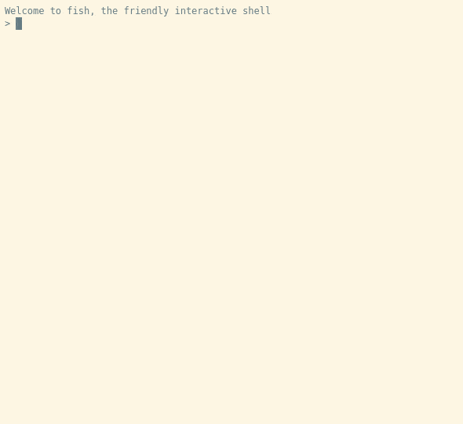

# KUKSA.VAL


This is KUKSA.val, the KUKSA **V**ehicle **A**bstration **L**ayer.

[](https://gitter.im/kuksa-val)
[](https://opensource.org/licenses/EPL-2.0)
[](https://ci.eclipse.org/kuksa/job/kuksa.val/job/master/)
[](https://codecov.io/gh/eclipse/kuksa.val)


KUKSA.val provides a [COVESA VSS data model](https://github.com/COVESA/vehicle_signal_specification) describing data in a vehicle. This data is provided to applications using a variant based on the W3C VISS Interface. KUKSA.val supports VISS V1 https://www.w3.org/TR/vehicle-information-service/ and extensions as well as parts of the upcomming VISS2 standard ([Gen2 Core](https://raw.githack.com/w3c/automotive/gh-pages/spec/VISSv2_Core.html), [Gen2 Transport](https://raw.githack.com/w3c/automotive/gh-pages/spec/VISSv2_Transport.html)), that are applicable to in-vehicle VSS servers.

See [Supported Protocol](doc/protocol/README.md) for a detailled overview of the supported VISS feature.

Check [System Architecture](doc/system-architecture.md) for an overview how KUKSA.val can be used and deployed in a modern Software Defined Vehicle.

## Features
 - Websocket interface, TLS-secured or plain
 - [Experimental REST interface](doc/rest-api.md), TLS-secured or plain
 - [Fine-grained authorisation](doc/jwt.md) based on JSON Webtokens (RFC 7519)
 - Built-in MQTT publisher
 - [Python viss client](./kuksa_viss_client) to interactively explore and modify the VISS data points and data structure
 - Multiple [example apps](./kuksa_apps) in different programming languages to communicate with different frameworks 
 - Multiple [feeders](./kuksa_feeders) to provide vehicle data for the `kuksa.val` server
 - Support most of data types, which is specified in [COVESA VSS data model](https://covesa.github.io/vehicle_signal_specification/rule_set/data_entry/data_types/).


## Quick start

### Using  Docker Image
If you prefer to build kuksa.val yourself skip to [Building KUKSA.val](#Building-kuksaval).

Download a current docker image from our CI server:

https://ci.eclipse.org/kuksa/job/kuksa.val/job/master/

The container images should work with any OCI compliant container runtime, in this document we assume you are using docker

Import the docker image

```
docker load -i kuksa-val-b3084b9-amd64.tar.xz
```

Your build tag may vary, and for ARM machines you need to choose an arm64 images.

Prepare an empty directory `$HOME/kuksaval.config`.  Run the docker image using the tag reported by `docker load`:

```bash
docker run -it --rm -v $HOME/kuksaval.config:/config  -p 127.0.0.1:8090:8090 -e LOG_LEVEL=ALL amd64/kuksa-val:b3084b9
```

More information on using the docker images can be found [here](doc/run-docker.md).

To learn, how to build your own docker image see [doc/build-docker.md](doc/build-docker.md).

If this is succesful you can skip to [using kuksa.val](#using-kuksaval).

## Building kuksa.val

First you need to fetch the source. ;ake sure you also get the needed submodules, e.g. by using the `--recursive` flag

```
git clone --recursive https://github.com/eclipse/kuksa.val.git
```

### Using devcontainer
If you are using [Visual Studio Code](https://code.visualstudio.com), and have a running version of   [Docker](https://docs.docker.com/) on your computer, KUKSA.val provides a [devcontainer](https://code.visualstudio.com/docs/remote/containers) configuration. Simply go to the VSCode command palette and use `Remote-Containers: Open Folder in Container...` to open the cloned KUKSA.val folder, or, if you already opened the folder in your local VSCode instance, choose `Remote-Containers: Reopen in Container...`

**Note**: If you are using Docker on a Mac OS, by default the VM used to run Dockers does not contain enough RAM to build KUKSA.val. Increase the RAM allocation for Docker to at least 4 GB in the [Docker Desktop Preferences](https://docs.docker.com/desktop/mac/#preferences)

Once the devcontainer is running you can continue with [compiling](#compiling).

### Manually install dependencies
First install the required packages. On Ubuntu 20.04 this can be achieved by

```
sudo apt install cmake build-essential libssl-dev libmosquitto-dev 
```

**Note**: If you use `cmake >= 3.14`, you do not need to install boost on your system. `cmake` will download the required boost for building. Otherwise you need install the [`boost==1.75`](https://www.boost.org/users/history/version_1_75_0.html) on the system.


### Compiling
Create a build folder inside the kuksa.val folder and execute cmake

```
mkdir build
cd build
cmake ..
```
If there are any missing dependencies, cmake will tell you. If everythig works fine, execute make

```
make
```

(if you have more cores, you can speed up compilation with something like  `make -j8`

Additional information about our cmake setup (in case you need adavanced options or intend to extend it) can be [found here](doc/cmake.md).


### Running kuksa.val
After you successfully built the kuksa.val server you can run it like this

```bash
#assuming you are inside kuksa.val/build directory
cd src
./kuksa-val-server  --vss ./vss_release_2.2.json --log-level ALL

```
Setting log level to `ALL` gives you some more information about what is going on.

You can also edit [config.ini](./config.ini) file to configure kuksa val server. This file will be copied to the build directory and used als default config,
if no other config file is specified using the command line option `-c/--config-file`.

For more information check [usage](doc/usage.md).

## Using kuksa.val
The easiest way to try `kuksa.val` out, is to use the test client [`kuksa_viss_client`](./kuksa_viss_client):

```
pip install kuksa-viss-client
kuksa_viss_client
```



The jwt tokens for testing can also be found under [kuksa_certificates/jwt](./kuksa_certificates/jwt).

You can also use the provided python sdk to develop your own `kuksa.val` clients. More details about `kuksa_viss_client` can be found [here](./kuksa_viss_client). 

Additionally, you can use the [example apps](./kuksa_apps) and [feeders](./kuksa_feeders) to handle vehicle data, interacting with the `kuksa.val` server.

## Using kuksa.val with a gRPC Client
Aditionally it exists a gRPC server. The easist way to test the server is the kuksa_viss_grpc_client.
To run the client follow these steps:

```
cd build/src
./kuksa_viss_grpc_client
```

If you do not know how to use the client:

```
./kuksa_viss_grpc_client --help
```


