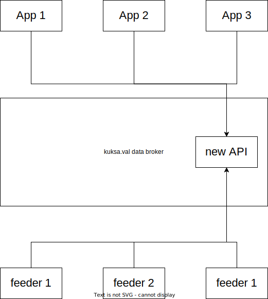

# KUKSA.val databroker
Currently there are two interfaces for communicating to the KUKSA.val databroker. Like you can see in the picture there is one client interface and one for the feeders. The interface to the feeders is also called collector. 

One unified gRPC interface is in development and will in the future replace the two separate interfaces. To build an easy client for the KUKSA.val databroker there is a python library currently in development. So the architecture will look like this:

