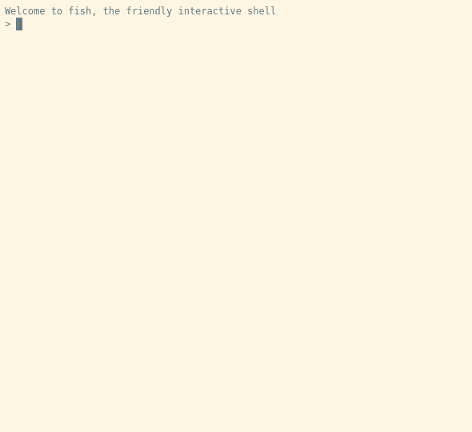

# Updating/Extending VSS structure during runtime

Upon startup the KUKSA.val server loads a JSON file describing the data points it manages. Usually this is a version of the [Geniivi Vehicle Signal Specification](https://github.com/GENIVI/vehicle_signal_specification/).
If you want to extend or modify this structure in your application, it is not neccesary to modify Genivi VSS, instead you can extend the loaded VSS structure during runtime.

## Overlays using updateVSSTree
The updateVSSTree method takes an input JSON that follows the same rules as the initial VSS JSON. This is added as an _overlay_ meaning:
 - If the new JSON specifies branches, actors, sensors or attribtues or metadata not in the original VSS tree, they will be added
  - If the new JSON refers to existing entries, the changed metadata will be overwritten

We suggest not creating overlay JSON files directly, but instead writing YAML files following the [Genivi VSS format](https://genivi.github.io/vehicle_signal_specification/) using [Genivi VSS tooling](https://github.com/GENIVI/vss-tools/) to convert them to JSON. That way your extension can be used in the whole VSS ecosystem.

Lets make an example

Consider you want to add a signal and change an existing VSS entry. 

Consider this VSS-compliant YAML file. We call it `roadster-elon.vspec`

```yaml
# Extend kuksa-val model   
- Vehicle:
  type: branch

- Vehicle.Speed:
  max: 9001
  type: sensor

- Vehicle.Private:
  type: branch

- Vehicle.Private.ThrustersActive:
  datatype: boolean
  type: sensor
```

What happened here? 
 - We changed the allowed max value for `Vehicle.Speed`. This value is already in the standard Genivi VSS data points, however in our use example we need to increase the allowed max value
  - We added a completely new signal `ThrustersActive` in the `Vehicle.Private` branch

Please note, that due to current vss-tools limitations you need to recreate the branch structure with all intermediate branches you use in the yaml.

Use the Genivi tools to generate a JSON

```bash
python3 vspec2json.py -i :my.id -I ../spec/ roadster-elon.vspec  roadster-elon.json
```

Now let's try on a running KUKSA.val instance with a vanilla VSS structure.
Using the test client, you can update the VSS tree like this:
```
updateVSSTree roadster-elon.json 
```

Then you can check, that the new signal is available and the max speed limit has increased:


**Note:** You may need the [super-admin.json.token](../kuksa_certificates/jwt/super-admin.json.token) for authorization. 

## Hot-patching with updateMetaData
if you just want to add or change a single metadata item in a signal or sensor, going through the whole VSS tooling may be a little cumbersome. Instead, you can use the testclient to update metadata of a single path directly, if you have the permission to modify metadata:

```json
updateMetaData updateMetaData Vehicle.Speed '{"max":9999}'
```



**Note:**: `updateMetaData` is only performing one-level-deep shallow merge. If multi-level merge is required, use `updateVSSTree` instead.

## Limitations
As the Input data to `updateVSSTree` as well as `updateMetaData`is merged with the existing data structure, there is no way to _remove_ previously added elements.

**This feature schould be considered Beta quality.**
Similar to the initial JSON, there is not much input verification going on. We _check_ that you provide syntactically valid JSON, we _trust_ that it is a valid VSS structure. Therefore, as a system desing suggestion, we recommend you perform any neccesary, potentially dangerous, data structure modifcations during an initialization phase.
