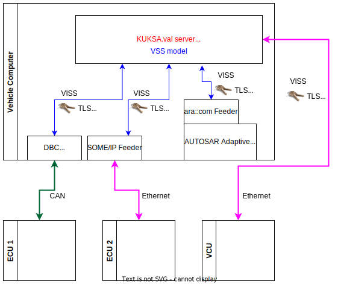
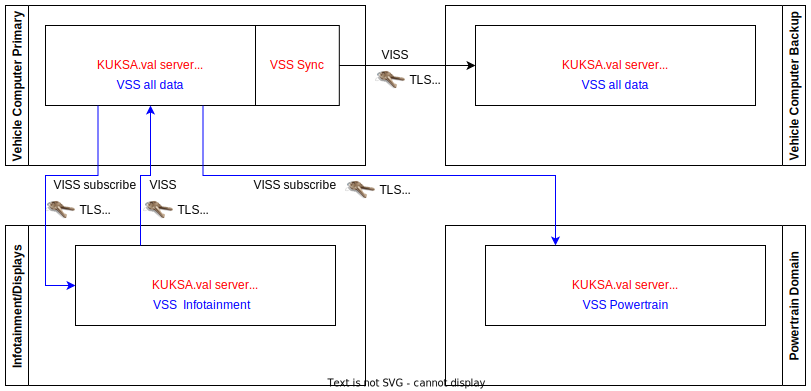

# System Architecture and Deployment

The KUKSA.val aims to provide a consistent view of all signals inside a vehicle. The data model follows the [COVESA Vehicle Signal Specification](https://github.com/COVESA/vehicle_signal_specification) while the data is accessed using either a variant of the [W3C VISS protocol](https://github.com/w3c/automotive) or a [GRPC](https://grpc.io)-based protocol.

The following picture shows the basic system architecture:

KUKSA.val runs on a vehicle computer with a given VSS model, the model is populated and updated by *data feeder* components. A data feeder might get its information directly fom a sensor, from the vehicle busses, or from lower parts of the software stack.

KUKSA clients (feeders & applications) are using the VISS or GRPC protocols to talk to KUKSA.val. Transport layer security is provided by TLS. JWT tokens are used to enforce access rights on a signal level, so that each client only has read and write access to a well defined subset of the VSS model.

## Data Feeders 
Components providing data for leaves in the VSS tree are called  *data feeders*. Technically they are just normal KUKSA.val clients. Usually a feeder will gather some data from a vehicle using any kind of standard or proprietary protocol, convert its representation the one mandated by VSS and set the VSS signal using the VISS or GRPC protocol.

The following picture shows different kinds of possible KUKSA.val feeders 

We assume running KUKSA.val on a vehicle computer. Some signals might originate in an embedded ECU only connected via CAN (e.g. ECU 1). Published data is received by the vehicle computer and can be mapped to the VSS data model by a feeder. The [DBC Feeder](https://github.com/eclipse/kuksa.val.feeders/tree/main/dbc2val) that is part of the KUKSA project allows mapping of data from a CAN bus based on a DBC description and some mapping rules.

Other ECUs with Ethernet connectivity might publish data as SOME/IP services. Following the pattern of the CAN feeder, a SOME/IP feeder mapping data to the VSS model can be created.

Some data might originate in the same compute unit running the KUKSA.val. In this example we assume the Vehicle Computer runs an AUTOSAR Adaptive subsystem. In that case a feeder using the APIs of the underlying system can be created, without the need to parse a specific serialisation first (ara::com Feeder).

Finally, there may be other  processor based platforms in a vehicle such as another vehicle computer, a domain, or zone controller or an infotainment system (VCU). These systems can feed data by interacting with the remote KUKSA.val server by using the VISS protocol directly. 

Any feeder can make use of the [KUKSA.val client library](../kuksa-client/) to interact with KUKSA.val using VISS or GRPC.

## Applications
Applications are accessing vehicle signals through KUKSA.val. The following figure shows common patterns:

A standard application ("Application)"  will request data from KUKSA.val and "do something" with it. As simple example is gathering some signals and visualizing them. The [node.red examples](../kuksa_apps/node-red) in KUKSA.val are an example of this pattern.

Often data needs to be made available in the cloud, or other vehicle-external systems. Especially when connected via cellular networks, being hidden behind NATs or using dynamic IP addresses, the VISS/GRPC pattern of contacting a VSS server is not a good fit. The common pattern is, that the vehicle pushes relevant data, using suitable IoT protocols and potentially dealing with buffering and connection loss. This is the "Cloud Adapter" pattern. An example is the [KUKSA.val S3 uploader](../kuksa_apps/s3/).

As a VSS data catalogue can contain signals of different abstraction levels, often higher level signals depend on lower level ones. Thus a KUKSA.val application might use data from some signals to calculate the value of of others (Signal Refinement). An example is, taking current battery voltage and other low level signals from the battery system to calculate a state-of-charge and pushing it back. Another service might use state of-charge, system and ambient temperature to calculate remaining range.

Any application can make use of the [KUKSA.val client library](../kuksa-client/) to interact with KUKSA.val using VISS or GRPC.

## Where to deploy KUKSA.val in a vehicle

The idea behind VSS and KUKSA.val is, to provide a single entry point to all vehicle data. As in a real vehicle data is distributed and not all domains need access to all data you might opt to run several servers, each providing a subset of all vehicle data. This can also increase resiliency of the system and allows to separate safety domains.

What is considered a suitable deployment is very much dependent on the vehicle architecture and the scope of data managed in VSS.

The following figure shows several possible patterns:

The example assumes the primary vehicle computer contains the fully populated VSS model for that vehicle. That is the simplest deployment and expected in simple vehicles, that might only have one computer able to run KUKSA.val and protocols such as VISS.

In a redundancy scenario there may be a backup vehicle computer with a KUKSA.val instance that is kept in sync, so that in case of a failover, the last known data is available immediately for all VSS data points. We assume an optimized VSS Sync component to be used that might deal with one-way or two-way syncs. Currently KUKSA.val does not include a sync mechanism.

A vehicle can have additional  domain controllers such as the powertrain controller. The Powertrain controller might use VSS to manage internal data not relevant to other domains as well as accessing other VSS data relevant to powertrain functionality provided by the central vehicle computer.

The Infotainment/Displays example extends this pattern, where the system subscribes needed data from the central Vehicle Computer (e.g. data that needs to be visualized), but also feeds data back to main VSS model (e.g. if a driver sets charge limits in the UI). 
