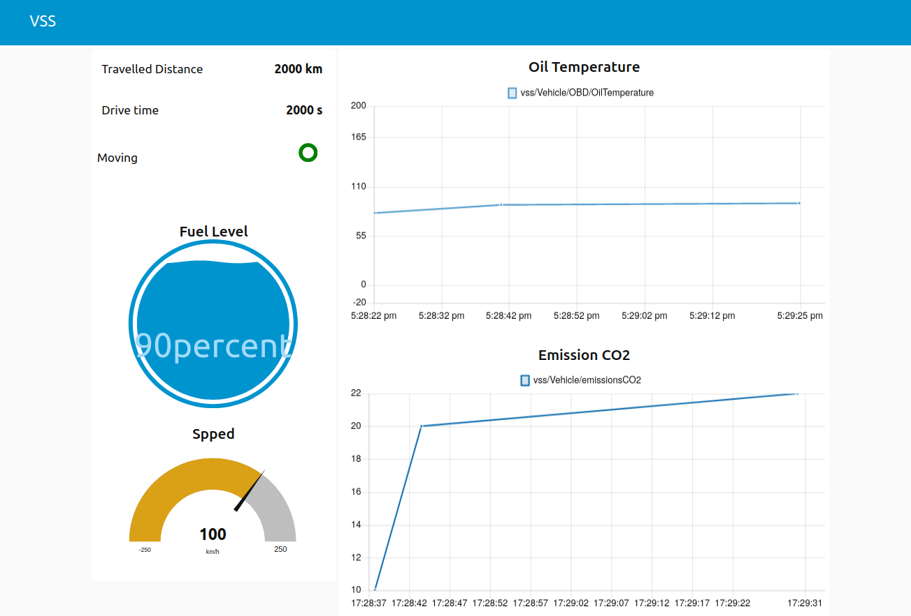

# Flow for node-red dashboard

After installing [node-red](https://nodered.org/), you can import the json file to receive data from kuksa-val-server. Then you can use the node-red dashboard feature to view data.

## Dependencies
The following node red extensions are used in the example flows:
- [node-red-dashboard](https://flows.nodered.org/node/node-red-dashboard)
- [node-red-contrib-web-worldmap](https://flows.nodered.org/node/node-red-contrib-web-worldmap)

## MQTT
[mqtt-examples.json](./mqtt-examples.json) subscribes some mqtt topics, which will be published by kuksa-val-server

*Note*: Do not forget to config your kuksa-val-server to publish the needed topics using the option `--mqtt.publish`.

## Websocket
- [websocket-subscription.json](./websocket-subscription.json) do the same like the mqtt example above via websocket subscription feature.
- [websocket-advanced.json](./websocket-advanced.json) implements a test client and uses secure connection with server

