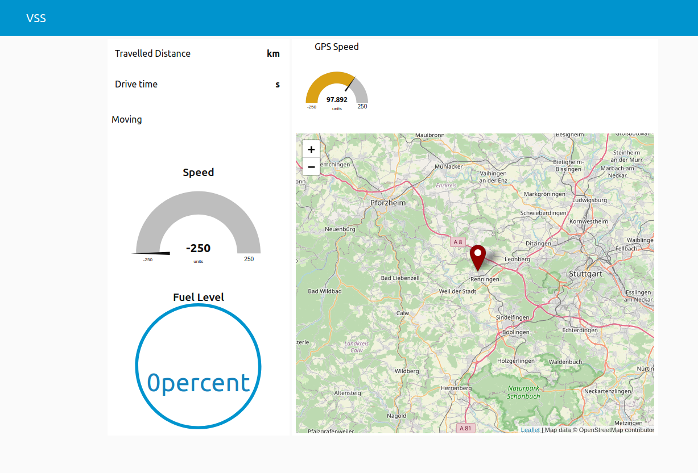

# Flow for node-red dashboard

This example uses [node-red](https://nodered.org/) but an installation is not required at your machine, as we are using Docker. You can import the json file to receive data from kuksa-val-server. Then you can use the node-red dashboard feature to view data.

## Dependencies
### Node-red extensions
The following node red extensions are used in the example flows:
- [node-red-dashboard](https://flows.nodered.org/node/node-red-dashboard)
- [node-red-contrib-web-worldmap](https://flows.nodered.org/node/node-red-contrib-web-worldmap)

### Installation
To test the node-red examples, you need `node-red` and `kuksa.val` server.

Since we provide docker images to simplify the setup process. You can install the docker at first:
```
sudo apt install docker.io
```

Then load `kuksa.val` docker images:
```
docker pull ghcr.io/eclipse/kuksa.val/kuksa-val:master
```

After that, just start all needed container using [`docker-compose.yml`](./docker-compose.yml):
```
sudo apt install docker-compose
docker-compose up -d
```
`-d` for detach.

**Note**: You need to be in this [directory](./) to be able to start the [`docker-compose.yml`](./docker-compose.yml) to use `docker-compose` to start all docker containers or shut down all docker containers:
```
docker-compose down
```

**Note**: At first start, you may need to install the [node red extensions](#node-red-extensions) under the [palette manager](https://nodered.org/docs/user-guide/editor/palette/manager).

By default, the mqtt flows will be configured in node-red. You can also use the import feature inside node-red to try the websocket example [below](#websocket).

<!-- markdown-link-check-disable -->

Now you can view the example under [http://localhost:1880](http://localhost:1880/).

<!-- markdown-link-check-enable -->

To test the example, you can use [Kuksa Python SDK Client](https://github.com/eclipse-kuksa/kuksa-python-sdk) or use the [gps feeder](https://github.com/eclipse/kuksa.val.feeders/tree/main/gps2val).
In [`feeders.yml`](./feeders.yml), you can find the experimental [config](kuksa_config/gpsd_feeder.ini) for gps feeder container. You use the following command to also start containers of feeders:

```
docker-compose -f docker-compose.yml  -f feeders.yml up
```


## MQTT
[mqtt/flows.json](./mqtt/flows.json) subscribes some mqtt topics, which will be published by kuksa-val-server

*Note*: Do not forget to config your `kuksa-val-server` to publish the needed topics using the option `--mqtt.publish`, if you do not use [`docker-compose.yml`](./docker-compose.yml) to start the `kuksa-val-server`.

## Websocket
- [websocket-subscription.json](./websocket-subscription.json) do the same like the mqtt example above via websocket subscription feature.
- [websocket-advanced.json](./websocket-advanced.json) implements a test client and uses secure connection with server


