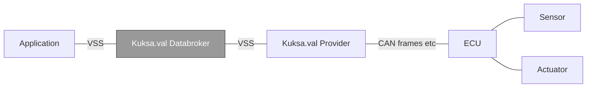

<!-- Improved compatibility of back to top link: See: https://github.com/othneildrew/Best-README-Template/pull/73 -->
<a name="readme-top"></a>

<!-- PROJECT LOGO -->
<br />
<div align="center">
  <a href="https://github.com/github_username/repo_name">
    
  </a>

<h3 align="center">Eclipse Kuksa.val&trade; Databroker</h3>

  <p align="center">
    Kuksa.val Databroker is a gRPC service acting as a broker of vehicle data / data points / signals.
    <br />
    <a href="./doc/user_guide.md"><strong>Explore the docs »</strong></a>
    <br />
    <br />
    <a href="https://github.com/eclipse/kuksa.val/issues">Report Bug</a>
    ·
    <a href="https://github.com/eclipse/kuksa.val/issues">Request Feature</a>
    ·
    <a href="https://matrix.to/#/#kuksa-val_community:gitter.im">Chat</a>
  </p>
</div>

<!-- TABLE OF CONTENTS -->
<details>
  <summary>Table of Contents</summary>
  <ol>
    <li>
      <a href="#intro">Intro</a>
      <ul>
        <li><a href="#features">Features</a></li>
        <li><a href="#built-with">Built With</a></li>
      </ul>
    </li>
    <li>
      <a href="#getting-started">Getting Started</a>
      <ul>
        <li><a href="#prerequisites">Prerequisites</a></li>
        <li><a href="#installation">Installation</a></li>
      </ul>
    </li>
    <li><a href="#usage">Usage</a></li>
    <li><a href="#building">Building</a></li>
    <li><a href="#roadmap">Roadmap</a></li>
    <li><a href="#contributing">Contributing</a></li>
    <li><a href="#license">License</a></li>
    <li><a href="#contact">Contact</a></li>
  </ol>
</details>

<!-- ABOUT THE PROJECT -->
## Intro

The [COVESA Vehicle Signal Specification](https://covesa.github.io/vehicle_signal_specification/) (VSS) defines the names and semantics of a large set of *data entries* that represent the current and/or intended state of a vehicle's sensors and actuators organized in a tree-like structure. For example, the vehicle's current speed is represented by the `Vehicle.Speed` entry.

However, VSS does not define how these signals are to be collected and managed within a vehicle, nor does it prescribe how other components in the vehicle can read or write signal values from and to the tree.

**Kuksa.val Databroker** is a resource efficient implementation of the VSS signal tree and is intended to be run within a vehicle on a microprocessor based platform. It allows applications in the vehicle to interact with the vehicle's sensors and actuators using a uniform, high level gRPC API for querying signals, updating current and target values of sensors and actuators and getting notified about changes to signals of interest.

<!-- black box diagram -- inputs/outputs -->



At the right end, [Kuksa.val Providers](https://github.com/eclipse/kuksa.val.feeders) implement the link between the Databroker and a vehicle's Electronic Control Units (ECU) to which the hardware sensors and actuators are physically attached.

Data is usually exchanged with ECUs by means of a CAN bus or Ethernet based protocols like SOME/IP. Providers translate between the low level messages used by these protocols and the Databroker's high level gRPC API calls to update a sensor's current reading or to forward a set-point value to an actuator via its controlling ECU.

<p align="right">(<a href="#readme-top">back to top</a>)</p>

### Features

- 100% Open Source (Apache 2.0 license)
- Written in Rust with an easy-to-use language agnostic gRPC interface
- Lightweight (<4 MB statically compiled), allowing it to run on even small vehicle computers

<p align="right">(<a href="#readme-top">back to top</a>)</p>

<!-- GETTING STARTED -->
## Getting started

The quickest possible way to get Kuksa.val Databroker up and running.

> :memo: **Note:** The examples in this section do not use TLS nor access control. Please refer to the [User Guide](./doc/user_guide.md) for more sophisticated usage examples.

### Prerequisites

* [Docker Engine](https://docs.docker.com/engine/install/) or [Podman](https://podman.io/docs/installation)
* A custom Docker *bridge* network
  ```sh
  docker network create kuksa
  ```

### Starting Databroker

1. Start Databroker in a container attached to the *kuksa* bridge network using hostname *Server*:

   ```sh
   docker run -it --rm --name Server --network kuksa ghcr.io/eclipse/kuksa.val/databroker:master --insecure
   ```
   > :bulb: **Tip:** You can stop the container using `ctrl-c`.

### Reading and writing VSS data using the CLI

1. Start the CLI in a container attached to the *kuksa* bridge network and connect to the Databroker container:
  The databroker supports both of ```sdv.databroker.v1``` and ```kuksa.val.v1``` as an API. Per default the databroker-cli uses the ```sdv.databroker.v1``` interface. To change it use ```--protocol``` option when starting. Chosse eihter one of ```kuksa-val-v1``` and ```sdv-databroker-v1```.


   ```sh
   # in a new terminal
   docker run -it --rm --network kuksa ghcr.io/eclipse/kuksa.val/databroker-cli:master --server Server:55555
   ```

   The CLI provides an interactive prompt which can be used to send commands to the Databroker.

   ```console
     ⠀⠀⠀⢀⣤⣶⣾⣿⢸⣿⣿⣷⣶⣤⡀
     ⠀⠀⣴⣿⡿⠋⣿⣿⠀⠀⠀⠈⠙⢿⣿⣦
     ⠀⣾⣿⠋⠀⠀⣿⣿⠀⠀⣶⣿⠀⠀⠙⣿⣷
     ⣸⣿⠇⠀⠀⠀⣿⣿⠠⣾⡿⠃⠀⠀⠀⠸⣿⣇⠀⠀⣶⠀⣠⡶⠂⠀⣶⠀⠀⢰⡆⠀⢰⡆⢀⣴⠖⠀⢠⡶⠶⠶⡦⠀⠀⠀⣰⣶⡀
     ⣿⣿⠀⠀⠀⠀⠿⢿⣷⣦⡀⠀⠀⠀⠀⠀⣿⣿⠀⠀⣿⢾⣏⠀⠀⠀⣿⠀⠀⢸⡇⠀⢸⡷⣿⡁⠀⠀⠘⠷⠶⠶⣦⠀⠀⢠⡟⠘⣷
     ⢹⣿⡆⠀⠀⠀⣿⣶⠈⢻⣿⡆⠀⠀⠀⢰⣿⡏⠀⠀⠿⠀⠙⠷⠄⠀⠙⠷⠶⠟⠁⠀⠸⠇⠈⠻⠦⠀⠐⠷⠶⠶⠟⠀⠠⠿⠁⠀⠹⠧
     ⠀⢿⣿⣄⠀⠀⣿⣿⠀⠀⠿⣿⠀⠀⣠⣿⡿
     ⠀⠀⠻⣿⣷⡄⣿⣿⠀⠀⠀⢀⣠⣾⣿⠟    databroker-cli
     ⠀⠀⠀⠈⠛⠇⢿⣿⣿⣿⣿⡿⠿⠛⠁     v0.4.1

   Successfully connected to http://Server:55555/
   sdv.databroker.v1 >
   ```
   > :bulb: **Tip:** The client retrieves metadata about the data entries that the Databroker knows about during startup. This allows for using `TAB`-completion of data entry names at the prompt.

1. Display help for supported commands
   ```sh
   help
   ```
   ```console
   connect [URI]            Connect to server
   get <PATH> [[PATH] ...]  Get signal value(s)
   set <PATH> <VALUE>       Set actuator signal
   subscribe <QUERY>        Subscribe to signals with QUERY
   feed <PATH> <VALUE>      Publish signal value
   metadata [PATTERN]       Fetch metadata. Provide PATTERN to list metadata of signals matching pattern.
   token <TOKEN>            Use TOKEN as access token
   token-file <FILE>        Use content of FILE as access token
   help                     You're looking at it.
   quit                     Quit
   ```
1. Get the vehicle's current speed

   ```sh
   get Vehicle.Speed
   ```
   ```console
   [get]  OK
   Vehicle.Speed: ( NotAvailable )
   ```
   > :memo: **Note** When Databroker starts up, all data entries are initialized to empty values. Thus, the vehicle speed is being reported as `NotAvailable`.

2. Set the vehicle's current speed

   ```sh
   feed Vehicle.Speed 100.34
   ```
   ```console
   [set]  OK
   ```

3. Get the vehicle's current speed

   ```sh
   get Vehicle.Speed
   ```
   ```console
   [get]  OK
   Vehicle.Speed: 100.34
   ```

Run the cli with:

4. Exit the client
   ```sh
   quit
   ```

<p align="right">(<a href="#readme-top">back to top</a>)</p>


<!-- USAGE EXAMPLES -->
## Usage

Please refer to the [User Guide](./doc/user_guide.md) for details regarding how to run and interact with Kuksa.val Databroker.

<p align="right">(<a href="#readme-top">back to top</a>)</p>

## Building

Building Kuksa.val Databroker from source code requires

* a [Rust tool chain](https://www.rust-lang.org/tools/install)
* a local workspace containing the source code
  ```shell
  git clone https://github.com/eclipse/kuksa.val.git
  ```

<p align="right">(<a href="#readme-top">back to top</a>)</p>

### Building Examples and Binaries

```sh
# in ${WORKSPACE}
cargo build --examples --bins
```

<p align="right">(<a href="#readme-top">back to top</a>)</p>

### Building release Binaries

```sh
# in ${WORKSPACE}
cargo build --bins --release
```

<p align="right">(<a href="#readme-top">back to top</a>)</p>

### Runing Databroker Test Cases

```shell
# in ${WORKSPACE}
cargo test --all-targets
```

<p align="right">(<a href="#readme-top">back to top</a>)</p>

## Contributing

Please refer to the [Kuksa.val Contributing Guide](../CONTRIBUTING.md).

<p align="right">(<a href="#readme-top">back to top</a>)</p>

## License

Kuksa.val Databroker is provided under the terms of the [Apache Software License 2.0](../LICENSE).

<p align="right">(<a href="#readme-top">back to top</a>)</p>

## Contact

Please feel free to create [GitHub Issues](https://github.com/eclipse/kuksa.val/issues) for reporting bugs and/or ask questions in our [Gitter chat room](https://matrix.to/#/#kuksa-val_community:gitter.im).

<p align="right">(<a href="#readme-top">back to top</a>)</p>
